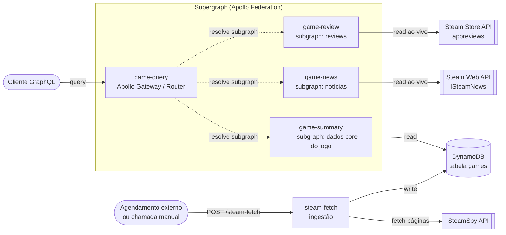

# steam-feed

Backend de um feed diário de jogos da Steam: uma lambda de ingestão alimenta o [SteamSpy](https://steamspy.com/api.php) em uma tabela DynamoDB, e um **supergraph GraphQL (Apollo Federation)** expõe esses dados combinados com notícias e reviews consultadas em tempo real na Steam. Deploy 100% automatizado via GitHub Actions.

## Arquitetura

Cinco pacotes npm **independentes** (sem monorepo/workspace — cada um com seu próprio `package.json`, `tsconfig.json` e lockfile), publicados como 5 funções Lambda separadas:



- **`game-query`** — o **router** do supergraph. Não tem lógica de domínio própria: carrega o SDL composto (`schema.graphql`) e usa `@apollo/gateway` para rotear cada campo de uma query GraphQL para o subgraph dono daquele campo. É o único ponto de entrada GraphQL para clientes.
- **`game-summary`** — subgraph dono da entidade `GameSummary` (`appId`, `name`, `developer`, `publisher`, `positive`, `negative`, `owners`, `dateAdded`). Lê a tabela DynamoDB `games`; se não houver jogos para o dia, cai de volta para uma leitura direta ao SteamSpy (sem persistir).
- **`game-news`** — subgraph que **estende** `GameSummary` com o campo `news`, resolvido buscando ao vivo na Steam Web API (`GetNewsForApp`). Não usa banco de dados.
- **`game-review`** — subgraph que **estende** `GameSummary` com o campo `reviews`, resolvido buscando ao vivo na Steam Store API (`appreviews`). Não usa banco de dados.
- **`steam-fetch`** — serviço de **ingestão** (REST, não faz parte do supergraph). `POST /steam-fetch` busca a próxima página do SteamSpy e grava os jogos + cursor de paginação na tabela `games`; `DELETE /steam-fetch` limpa a tabela.

## Apollo Federation

`game-query/supergraph.yaml` declara os 3 subgraphs GraphQL (`summary`, `news`, `review`) e é usado pelo [Rover](https://www.apollographql.com/docs/rover/) para compor o schema do supergraph:

```bash
cd game-query
npm run supergraph   # rover supergraph compose --config ./supergraph.yaml --output src/schema.graphql
```

O SDL composto resultante (`game-query/src/schema.graphql`) é o que o `ApolloGateway` carrega em runtime para decidir, campo a campo, para qual subgraph rotear cada parte de uma query. A entidade compartilhada `GameSummary` é referenciada por `appId` (`@key(fields: "appId")`) nos três subgraphs — `game-summary` é o dono, `game-news` e `game-review` a estendem para agregar `news` e `reviews` sem duplicar os dados core.

Exemplo de query que atravessa os três subgraphs numa única chamada ao `game-query`:

```graphql
query {
  gameSummary(appId: 570) {
    name
    owners
    news { title url }
    reviews { review votesUp }
  }
}
```

## Fluxo de dados

1. Um agendamento externo (ou chamada manual) dispara `POST /steam-fetch`.
2. `steam-fetch` busca a próxima página do SteamSpy, grava os jogos na tabela `games` e avança o cursor `lastPage` (guardado num item sentinela `appId = -1`).
3. Clientes consultam o supergraph via `game-query`, que roteia cada campo da query para `game-summary` (dados persistidos), `game-news` e `game-review` (dados ao vivo da Steam) e junta tudo numa resposta só.

## Desenvolvimento local

Cada pacote sobe seu próprio servidor local (`npm run dev`, com `tsx watch`), então rode-os em portas diferentes (`PORT`) para testar o fluxo completo:

| Pacote | Tipo de servidor | Rota(s) |
|---|---|---|
| `steam-fetch` | Express | `POST /steam-fetch`, `DELETE /steam-fetch` |
| `game-summary` | Apollo standalone | GraphQL subgraph |
| `game-news` | Apollo standalone | GraphQL subgraph |
| `game-review` | Apollo standalone | GraphQL subgraph |
| `game-query` | Apollo standalone (Gateway) | GraphQL supergraph — aponta para as `routing_url` definidas em `supergraph.yaml` |

```bash
cd steam-fetch && npm install && npm run dev     # PORT default 3001
cd game-summary && npm install && npm run dev    # PORT default 3000
cd game-news && npm install && npm run dev        # outra porta
cd game-review && npm install && npm run dev       # outra porta
cd game-query && npm install && npm run dev         # gateway, aponta para os subgraphs acima
```

## Deploy

Via GitHub Actions (`.github/workflows/main.yml`), disparado em todo `push` e manualmente (`workflow_dispatch`):

1. Autentica na AWS via **OIDC** (`aws-actions/configure-aws-credentials`, assume role — sem credenciais de longa duração).
2. Builda cada um dos 5 pacotes (`npm ci && npm run build`, bundle via `esbuild`).
3. Publica cada bundle como uma função Lambda separada (`aws-actions/aws-lambda-deploy`, runtime `nodejs24.x`):

| Função Lambda | Pacote | Handler |
|---|---|---|
| `game-summary` | `game-summary/dist` | `index.handler` |
| `game-review` | `game-review/dist` | `index.handler` |
| `game-news` | `game-news/dist` | `index.handler` |
| `game-query` | `game-query/dist` | `index.handler` |
| `steam-fetch` | `steam-fetch/dist` | `fetch.handler` |

As lambdas GraphQL (`game-summary`, `game-news`, `game-review`) ficam expostas por trás de um API Gateway em rotas `/subgraphs/*`, que são as `routing_url` referenciadas em `game-query/supergraph.yaml` — é para lá que o Gateway do `game-query` encaminha as sub-queries.

## Stack

- TypeScript + [esbuild](https://esbuild.github.io/) (bundle CJS, `target=node24`)
- [Apollo Server](https://www.apollographql.com/docs/apollo-server/) + [Apollo Federation](https://www.apollographql.com/docs/federation/) (`@apollo/subgraph`, `@apollo/gateway`, `@apollo/rover`)
- AWS Lambda (Node.js 24) + API Gateway, integração via `@as-integrations/aws-lambda`
- DynamoDB (`@aws-sdk/lib-dynamodb`)
- GitHub Actions + OIDC para deploy contínuo

## Licença

[Apache License 2.0](LICENSE)
